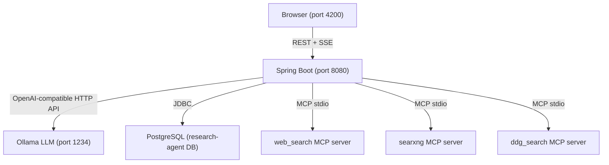

# Research Agent

A full-stack AI-powered research tool: submit a topic → LLM breaks it into sub-topics → searches the web with MCP/local tools → reads content from multiple sources → synthesizes findings into a report → displays everything via SSE streaming.

## Tech Stack

| Layer | Technology |
|-------|-----------|
| **Backend** | Java 21 + Spring Boot 3.5.4 + Spring AI 1.1.7 (OpenAI-compatible local LLM) — `research-agent-backend/` |
| **Frontend** | Angular 18+ with Signals/RxJS + Angular Material M3 — `research-agent-ui/` |
| **Database** | PostgreSQL |
| **LLM** | Ollama (OpenAI-compatible endpoint, e.g., gemma-4-26b) |
| **Search Tools** | MCP stdio servers: web_search, searxng, ddg_search + local fallback tools |

## Project Structure

```
Research-Agent/
├── research-agent-backend/          # Spring Boot application
│   ├── src/main/java/com/researchagent/
│   │   ├── config/                  # ChatClientConfig, AsyncConfig, WebConfig (CORS)
│   │   ├── controller/              # ResearchController, ResearchStreamController
│   │   ├── model/
│   │   │   ├── dto/                 # Request/Response DTOs (ResearchRequest, StepDTO, etc.)
│   │   │   ├── entity/              # JPA entities (ResearchSession, ResearchStep)
│   │   │   └── enums/               # ResearchStatus, StepType
│   │   ├── repository/              # Spring Data JPA repositories
│   │   ├── service/                 # Core business logic (orchestrator, streaming, cleanup)
│   │   ├── tool/                    # MCP tool router + local tools (WebSearchTool, UrlReaderTool)
│   │   └── ResearchAgentApplication.java
│   ├── src/main/resources/
│   │   ├── application.yml          # LLM config, datasource, MCP servers, SSE timeout
│   │   └── db/migration/V1__init_research_tables.sql
│   └── docs/                        # Backend documentation (ARCHITECTURE, API, MODELS, CONFIGURATION)
├── research-agent-ui/               # Angular application
│   ├── src/app/
│   │   ├── core/
│   │   │   ├── models/research.model.ts    # TypeScript interfaces for all data types
│   │   │   ├── services/                     # ResearchService, ResearchHistoryService
│   │   │   └── interceptors/debug.interceptor.ts
│   │   ├── features/
│   │   │   ├── active-research/              # Live streaming session view
│   │   │   ├── research-input/               # New research form with quick-start chips
│   │   │   ├── research-history/             # Paginated history + search/bulk-delete
│   │   │   └── history-detail/               # Historical session detail + follow-up
│   │   ├── shared/components/                # Reusable components (step-list, report-viewer, followup-form)
│   │   ├── app.routes.ts                     # Lazy-loaded route definitions
│   │   └── app.config.ts                     # App providers (Router, HttpClient, Markdown)
│   ├── proxy.conf.json                       # Dev server proxy: /api → localhost:8080
│   └── docs/                                 # Frontend documentation
├── AGENTS.md                                    # AI agent guidance for this repo
├── CLAUDE.md                                    # Claude Code specific guidance
└── openspec/changes/                            # OpenSpec change tracking (feature proposals)
```

## Quick Start

### Prerequisites

- **Java 21** (OpenJDK recommended)
- **Node.js 20+** with npm
- **PostgreSQL 15+** — create database: `createdb -U postgres research-agent`
- **Ollama** running locally — e.g., a model like `gemma-4-26b` available at `http://localhost:1234`

### Backend

```bash
cd research-agent-backend
export JAVA_HOME=/usr/lib/jvm/java-21-openjdk-amd64
mvn spring-boot:run          # Starts on port 8080
curl http://localhost:8080/api/research/history   # Verify running
```

### Frontend

```bash
cd research-agent-ui
npm install
npx ng serve --proxy-config proxy.conf.json    # Starts on port 4200, proxies /api → localhost:8080
```

## Architecture Overview



### Research Pipeline

1. **Topic Breakdown** (Phase 1): LLM parses the user's topic into structured sub-topics via JSON tool-calling
2. **Sub-topic Research** (Phase 2): For each sub-topic, the LLM calls MCP/local tools (`search`, `readUrl`) to gather information
3. **Final Report Synthesis** (Phase 3): LLM synthesizes all findings into a markdown report, streamed chunk-by-chunk via SSE

See [Backend ARCHITECTURE](research-agent-backend/docs/ARCHITECTURE.md) and [Frontend ARCHITECTURE](research-agent-ui/docs/ARCHITECTURE.md) for detailed component breakdowns.

## Key Implementation Notes

- **Spring AI 1.1.7** uses `spring-ai-starter-model-openai` artifact (NOT the old milestone name). Config classes are auto-configured — no bean definitions needed.
- **MCP Tool Routing**: Four stdio-based MCP servers (`web_search`, `searxng`, `excalidraw`, `ddg_search`) are configured in `application.yml`. The `McpToolRouter` component routes search tasks to preferred servers with fallback chains. Local Java tools (`WebSearchTool`, `UrlReaderTool`) serve as fallback when MCP servers are unavailable.
- **Angular standalone components**: All `@Component` decorators must include `standalone: true` when using the `imports` property.
- **Angular Material M3 theming**: Use `mat.define-theme((color: ()))`. The `all-component-themes($theme)` mixin must be wrapped in a CSS selector — cannot be called at root level.
- **SSE streaming**: Backend uses `Flux<String>` via `.stream().content()`; frontend detects connection loss with exponential backoff reconnection and falls back to polling on failure. A stall timer (90s) forces completion detection if no chunks arrive during report generation.
- **Abandoned session cleanup**: Background scheduler marks PROCESSING sessions stuck >1 hour as CANCELLED every 30 minutes (configurable via `app.cleanup.stale-after` and `app.cleanup.interval`).
- **PostgreSQL DDL-auto: `validate`** — no automatic schema generation. Schema is defined in `db/migration/V1__init_research_tables.sql`.

## Documentation Index

| Document | Location | Description |
|----------|----------|-------------|
| Backend Architecture | [research-agent-backend/docs/ARCHITECTURE.md](research-agent-backend/docs/ARCHITECTURE.md) | Component layout, data flow, orchestration pipeline |
| Backend API Reference | [research-agent-backend/docs/API.md](research-agent-backend/docs/API.md) | REST endpoints + SSE event types with examples |
| Backend Data Models | [research-agent-backend/docs/MODELS.md](research-agent-backend/docs/MODELS.md) | Entities, DTOs, enums, and internal models |
| Backend Configuration | [research-agent-backend/docs/CONFIGURATION.md](research-agent-backend/docs/CONFIGURATION.md) | application.yml settings, dependencies, env vars |
| Frontend Architecture | [research-agent-ui/docs/ARCHITECTURE.md](research-agent-ui/docs/ARCHITECTURE.md) | Component hierarchy, routing, SSE integration strategy |
| Frontend API Client | [research-agent-ui/docs/API.md](research-agent-ui/docs/API.md) | ResearchService methods and backend endpoint consumption |
| Frontend State Management | [research-agent-ui/docs/STATE-MANAGEMENT.md](research-agent-ui/docs/STATE-MANAGEMENT.md) | Signal-based state, SSE→signal mapping, computed signals |
| Frontend Models | [research-agent-ui/docs/MODELS.md](research-agent-ui/docs/MODELS.md) | TypeScript interfaces mirroring backend structure |
| Frontend Configuration | [research-agent-ui/docs/CONFIGURATION.md](research-agent-ui/docs/CONFIGURATION.md) | angular.json, tsconfig, proxy, build config |

## Development Workflow

1. See [CLAUDE.md](CLAUDE.md) for AI agent-specific guidance on this repository.
2. Changes follow the OpenSpec workflow tracked under `openspec/changes/<name>/`.
