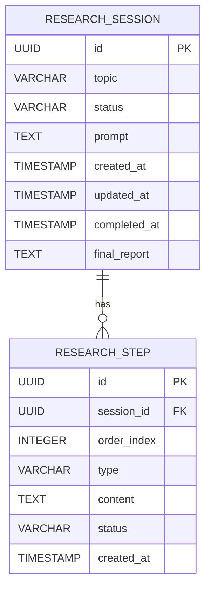

# Research Agent Backend — Database & Data Models

## Overview

The backend uses PostgreSQL with JPA entities and a single Flyway migration file. The schema consists of two tables: `research_session` (top-level) and `research_step` (child, cascading delete).

---

## Database Schema

### Migration File

**Location**: `src/main/resources/db/migration/V1__init_research_tables.sql`

This is the only migration file. Flyway is configured in `application.yml` but the dependency is commented out in `pom.xml`. The schema validation mode (`ddl-auto: validate`) ensures entities match the database without auto-creation.

**Note**: Database must be created manually before first run:
```bash
createdb -U postgres research-agent
```

### `research_session` Table

| Column | Type | Constraints | Description |
|--------|------|-------------|-------------|
| `id` | UUID | PRIMARY KEY, DEFAULT gen_random_uuid() | Unique session identifier |
| `topic` | VARCHAR(1024) | NOT NULL | User's original research query |
| `status` | VARCHAR(32) | NOT NULL, DEFAULT 'PENDING' | Current session state |
| `prompt` | TEXT | (nullable) | System prompt used for this session |
| `created_at` | TIMESTAMP WITH TIME ZONE | DEFAULT NOW() | Session creation timestamp |
| `updated_at` | TIMESTAMP WITH TIME ZONE | DEFAULT NOW() | Last update timestamp |
| `completed_at` | TIMESTAMP WITH TIME ZONE | (nullable) | Completion/failure timestamp |
| `final_report` | TEXT | (nullable) | Synthesized research report content |

**Indexes:**
- `idx_research_session_status` on `(status)` — for filtering by status in history queries
- `idx_research_session_created` on `(created_at DESC)` — for ordering history results

### `research_step` Table

| Column | Type | Constraints | Description |
|--------|------|-------------|-------------|
| `id` | UUID | PRIMARY KEY, DEFAULT gen_random_uuid() | Unique step identifier |
| `session_id` | UUID | NOT NULL, FK → research_session(id) ON DELETE CASCADE | Parent session reference |
| `order_index` | INTEGER | NOT NULL — unique within a session (with session_id) | Step ordinal position |
| `type` | VARCHAR(32) | NOT NULL | Type of step being executed |
| `content` | TEXT | (nullable) | Step output content (may be null if step failed before producing content) |
| `status` | VARCHAR(32) | NOT NULL, DEFAULT 'PENDING' | Current step state |
| `created_at` | TIMESTAMP WITH TIME ZONE | DEFAULT NOW() | Step creation timestamp |

**Indexes:**
- Unique constraint on `(session_id, order_index)` — ensures step ordering within a session
- `idx_research_step_session` on `(session_id)` — for fetching all steps of a session

---

## Hibernate Configuration Notes

From `application.yml`:

```yaml
spring.jpa.hibernate.ddl-auto: validate       # Schema validation only — no auto-modification
spring.jpa.properties.hibernate.dialect: org.hibernate.dialect.PostgreSQLDialect
spring.jpa.properties.hibernate.jdbc.lob.non_contextual_creation: true  # Avoids PostgreSQL LOB API error in auto-commit mode
```

The `hibernate.jdbc.lob.non_contextual_creation` setting is critical — it instructs Hibernate to stream LOB content instead of using PostgreSQL's OID-based Large Object API, preventing the "Large Objects may not be used in auto-commit mode" error that occurs with TEXT columns during JPA operations.

---

## Enum Mappings (Entity → Database)

### `ResearchStatus` Entity Enum

| Value | Meaning | Transitions From |
|-------|---------|------------------|
| `PENDING` | Session created but not yet started | None — transient state, immediately transitions to PROCESSING |
| `PROCESSING` | Research is actively running | PENDING |
| `COMPLETED` | Research finished successfully | PROCESSING (only) |
| `FAILED` | Research failed due to an error | PROCESSING (on exception) |
| `CANCELLED` | Research cancelled by user or cleanup scheduler | PROCESSING (via DELETE endpoint or AbandonedSessionCleanupService) |

### `StepType` Entity Enum

| Value | Meaning | Phase |
|-------|---------|-------|
| `BREAKDOWN` | Topic breakdown into sub-topics | Phase 1 |
| `SUBTOPIC` | Individual sub-topic research | Phase 2 |
| `SEARCH` | Web search via MCP/local tools | Phase 2 (within SUBTOPIC) |
| `READ` | URL content extraction via MCP/local tools | Phase 2 (within SUBTOPIC) |
| `SYNTHESIS` | Finding synthesis | Phase 3 |
| `FINAL_REPORT` | Final report generation | Phase 3 |

**Note on step status values:** The database stores raw strings ("PENDING"/"RUNNING"/"COMPLETED"/"FAILED") which are inconsistent with the `ResearchStatus` enum used elsewhere (which uses "PROCESSING" not "RUNNING"). The entity's default value `"PENDING"` is a hardcoded string rather than an enum constant.

---

## JPA Relationships



- **CascadeType.ALL, orphanRemoval=true** on the `ResearchSession.steps` collection — deleting a session cascades to all steps.
- **LAZY fetch** on `ResearchStep.session` — step entities don't load the parent unless explicitly accessed.
- `findByIdWithSteps(UUID)` in the repository eagerly loads the steps collection to avoid N+1 queries when returning sessions with their full history.

---

## Cleanup Scheduler Query

The `AbandonedSessionCleanupService` uses this custom query:

```java
List<ResearchSession> findAllByStatusAndCreatedAtBefore(ResearchStatus status, LocalDateTime cutoff);
```

Spring Data JPA derives this from the method name — finds all sessions where `status = PROCESSING` AND `created_at < cutoff`. Results are iterated and each is updated to `CANCELLED` with a save.
